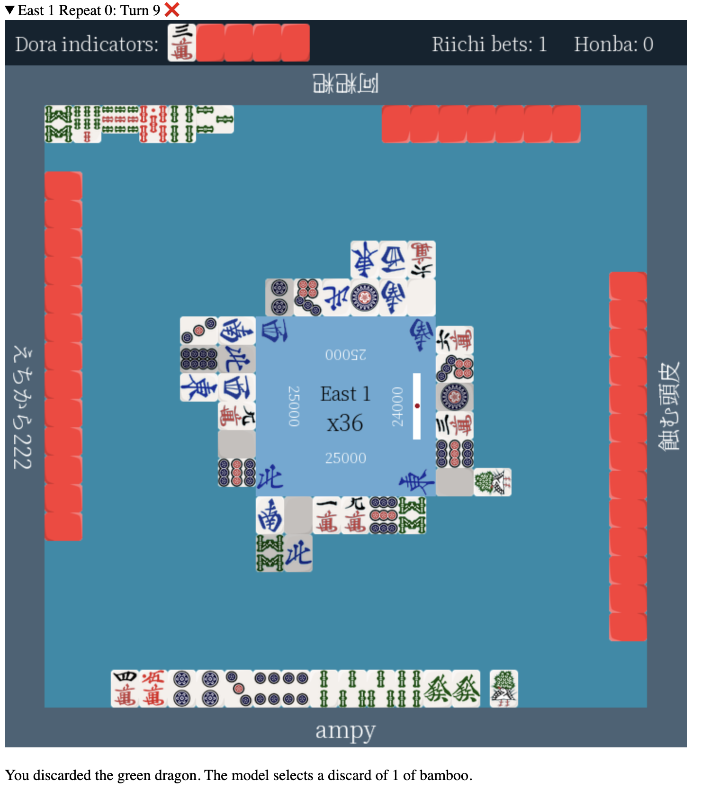

<a id="readme-top"></a>

<!-- PROJECT LOGO -->
<br />
<div align="center">
<h3 align="center">Riichi Mahjong Game Reviewer</h3>

</div>

<div align="center">


</div>

<!-- TABLE OF CONTENTS -->
<details>
  <summary>Table of Contents</summary>
  <ol>
    <li>
      <a href="#about-the-project">About The Project</a>
      <ul>
            <li><a href="#features">Features</a></li>
            <li><a href="#screenshots">Screenshots</a></li>
        </ul>
    </li>
    <li>
      <a href="#getting-started">Getting Started</a>
      <ul>
        <li><a href="#prerequisites">Prerequisites</a></li>
        <li><a href="#installation">Installation</a></li>
      </ul>
    </li>
    <li>
        <a href="#usage">Usage</a>
        <ul>
            <li><a href="#i-just-want-to-see-that-the-code-works">I just want to see that the code works.</a></li>
            <li><a href="#i-want-to-review-my-own-mahjong-soul-game">I want to review my own Mahjong Soul game.</a></li>
            <li><a href="#i-would-like-to-try-retraining-the-model">I would like to try retraining the model.</a></li>
        </ul>
    </li>
    <li>
      <a href="#performance-metrics">Performance Metrics</a>
      <ul>
        <li><a href="#model-accuracy">Model Accuracy</a></li>
        <li><a href="#processing-speed">Processing Speed</a></li>
        <li><a href="#requirements">Requirements</a></li>
      </ul>
    </li>
    <li><a href="#license">License</a></li>
    <li><a href="#contact">Contact</a></li>
  </ol>
</details>

<!-- ABOUT THE PROJECT -->
## About The Project

This application analyzes your riichi mahjong game log, producing an html game review which identifies the best choice to make at each turn.

### Features

- 🎯 **AI-Powered Analysis**: Neural network trained on 1,000 games
- 📊 **Visual Game Replay**: Interactive HTML review with tile graphics
- 🎮 **Mahjong Soul Support**: Import games from Mahjong Soul

### Screenshots

<div align="center">
  
  <p><em>Example of AI-powered game analysis with move explanations</em></p>
</div>

<p align="right">(<a href="#readme-top">back to top</a>)</p>

<!-- GETTING STARTED -->
## Getting Started

Follow these steps to obtain a local copy of the project.

### Prerequisites

Install Python version 3.13 from [python.org](python.org). I also recommend setting up a virtual environment using miniconda.

### Installation

1. Clone the repository.
   ```sh
   git clone https://github.com/arthur-nghiem/mahjong-reviewer.git
   ```
2. Navigate to your local copy and install all dependencies: 
   ```sh
   pip install .
   ```
<p align="right">(<a href="#readme-top">back to top</a>)</p>


<!-- USAGE EXAMPLES -->
## Usage

Please refer to the appropriate section depending on your use case.

### I just want to see that the code works.

To run the reviewer on the sample game included in this repository, enter the following: 
   ```sh
   python -m mahjong_reviewer 
   ```

You will find the generated game review at `output/sample_game/game_review.html`. 
Alternatively, you can access `docs/example-output.html` to view this example without running any code. 

### I want to review my own Mahjong Soul game.

1. Refer to [this guide](https://github.com/Equim-chan/mjai-reviewer/blob/master/mjsoul.adoc) to download your Mahjong Soul game as a `.json` file.

2. Build [mjai-reviewer](https://github.com/Equim-chan/mjai-reviewer). There is no need to install Mortal or Akochan.

3. Within the `mjai-reviewer` directory, navigate to `target/release`. Place the `.json` file you obtained in step 1 in this folder. 

4. Run the following command, replacing `your_json_name` with the actual file name. You may replace `converted_game` with a different output file name in this and all following steps if you prefer.

    ```sh
    ./mjai-reviewer -i your_json_name.json --mjai-out converted_game.jsonl --no-review
    ```

5. Place `converted_game.jsonl` in your `mahjong-reviewer/input` directory.

6. Enter the following command, replacing `your_username` with your actual Mahjong Soul username: 
    ```sh
    python -m mahjong_reviewer converted_game.jsonl -u your_username
    ```

You will find the generated game review at `output/converted_game/game_review.html`.

### I would like to try retraining the model. 

1. The archive and raw data directories are not included in this repository due to size limitations. Install `archive` from [this Kaggle dataset](https://www.kaggle.com/datasets/shokanekolouis/tenhou-to-mjai) and place it in your `mahjong-reviewer` directory.

2. To decompress the `archive` into `data`, run `decompress.py`:
    ```sh
    python -m src.mahjong_reviewer.scripts.decompress 
   ```

3. To generate data for machine learning, run `generator.py`:
    ```sh
    python -m src.mahjong_reviewer.data.generator
    ```

4. To train the model, run `trainer.py`:
    ```sh
    python -m src.mahjong_reviewer.models.trainer
    ```
5. To test the retrained model on the sample game, run `__main__.py`: 
    ```sh
    python -m mahjong_reviewer 
    ```

You will find the generated game review at `output/sample_game/game_review.html`.

<p align="right">(<a href="#readme-top">back to top</a>)</p>

<!-- LICENSE -->
## License

Distributed under the MIT license. See `LICENSE.txt` for more information.

<p align="right">(<a href="#readme-top">back to top</a>)</p>

<!-- CONTACT -->
## Contact

Arthur Nghiem -  arthur.nghiem@gmail.com

Project Link: [https://github.com/arthur-nghiem/mahjong-reviewer](https://github.com/arthur-nghiem/mahjong-reviewer)

<p align="right">(<a href="#readme-top">back to top</a>)</p>

